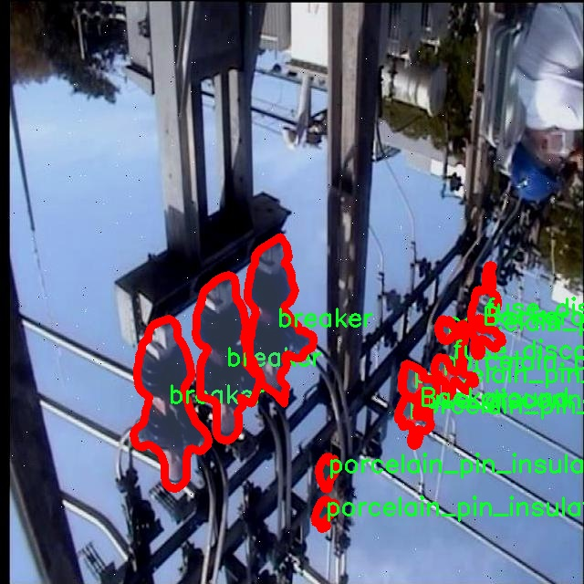

# 电力设备图像分割系统系统源码＆数据集分享
 [yolov8-seg-efficientViT＆yolov8-seg-C2f-DCNV2等50+全套改进创新点发刊_一键训练教程_Web前端展示]

### 1.研究背景与意义

项目参考[ILSVRC ImageNet Large Scale Visual Recognition Challenge](https://gitee.com/YOLOv8_YOLOv11_Segmentation_Studio/projects)

项目来源[AAAI Global Al lnnovation Contest](https://kdocs.cn/l/cszuIiCKVNis)

研究背景与意义

随着电力行业的快速发展，电力设备的安全运行和维护变得愈发重要。电力设备在电力系统中扮演着至关重要的角色，任何设备故障都可能导致电力供应中断，甚至引发更大范围的安全事故。因此，及时、准确地识别和检测电力设备的状态，成为保障电力系统稳定运行的关键。传统的电力设备检测方法多依赖人工巡检，效率低下且容易受到人为因素的影响，无法满足现代电力系统对实时监测和智能化管理的需求。

近年来，计算机视觉技术的快速发展为电力设备的自动检测和识别提供了新的解决方案。尤其是基于深度学习的目标检测和图像分割技术，已经在多个领域取得了显著的成果。YOLO（You Only Look Once）系列模型以其高效的实时检测能力，逐渐成为目标检测领域的主流方法。YOLOv8作为该系列的最新版本，结合了更为先进的网络结构和算法优化，能够在保证检测精度的同时，显著提高处理速度。然而，尽管YOLOv8在目标检测方面表现优异，但在电力设备的图像分割任务中，仍然存在一定的局限性，尤其是在复杂背景和多类设备的情况下，如何提高分割精度和鲁棒性，仍然是一个亟待解决的问题。

本研究旨在基于改进的YOLOv8模型，构建一个电力设备图像分割系统，以实现对电力设备的高效、准确识别与分割。我们将使用包含4000张图像的elek-seg数据集，该数据集涵盖了16类电力设备，包括断路器、变压器、绝缘子等。这些设备在电力系统中具有不同的功能和特性，针对不同类别的设备进行有效的图像分割，将有助于提高设备检测的精度和效率。通过对YOLOv8模型的改进，我们计划引入多尺度特征融合、注意力机制等技术，以增强模型对复杂场景的适应能力，从而提升电力设备的分割效果。

本研究的意义不仅在于技术上的创新，更在于其在实际应用中的潜在价值。通过实现高效的电力设备图像分割系统，可以为电力公司提供更为精准的设备状态监测手段，降低人工巡检的成本，提高设备故障的预警能力。此外，该系统还可以为电力设备的维护和管理提供数据支持，帮助电力公司优化资源配置，提升整体运营效率。综上所述，本研究将为电力行业的智能化发展提供有力的技术支撑，推动电力设备的自动化管理进程，为实现安全、稳定、高效的电力供应贡献力量。

### 2.图片演示


##### 注意：由于此博客编辑较早，上面“2.图片演示”和“3.视频演示”展示的系统图片或者视频可能为老版本，新版本在老版本的基础上升级如下：（实际效果以升级的新版本为准）

  （1）适配了YOLOV8的“目标检测”模型和“实例分割”模型，通过加载相应的权重（.pt）文件即可自适应加载模型。

  （2）支持“图片识别”、“视频识别”、“摄像头实时识别”三种识别模式。

  （3）支持“图片识别”、“视频识别”、“摄像头实时识别”三种识别结果保存导出，解决手动导出（容易卡顿出现爆内存）存在的问题，识别完自动保存结果并导出到tempDir中。

  （4）支持Web前端系统中的标题、背景图等自定义修改，后面提供修改教程。

  另外本项目提供训练的数据集和训练教程,暂不提供权重文件（best.pt）,需要您按照教程进行训练后实现图片演示和Web前端界面演示的效果。

### 3.视频演示

[3.1 视频演示](https://www.bilibili.com/video/BV1fS1kYBEsT/)

### 4.数据集信息展示

##### 4.1 本项目数据集详细数据（类别数＆类别名）

nc: 16
names: ['Background', 'breaker', 'closed_blade_disconnect_switch', 'closed_tandem_disconnect_switch', 'current_transformer', 'fuse_disconnect_switch', 'glass_disc_insulator', 'lightning_arrester', 'muffle', 'open_blade_disconnect_switch', 'open_tandem_disconnect_switch', 'porcelain_pin_insulator', 'potential_transformer', 'power_transformer', 'recloser', 'tripolar_disconnect_switch']


##### 4.2 本项目数据集信息介绍

数据集信息展示

在本研究中，我们使用了名为“elek-seg”的数据集，以改进YOLOv8-seg电力设备图像分割系统。该数据集专门针对电力设备的图像分割任务，涵盖了多种电力设备的类别，旨在提高电力设备的自动识别和处理能力，从而为电力行业的智能化发展提供支持。

“elek-seg”数据集包含16个类别，具体包括：背景、断路器、闭合刀闸、闭合双刀闸、电流互感器、熔断器刀闸、玻璃盘绝缘子、避雷器、消声器、开放刀闸、开放双刀闸、瓷针绝缘子、潜在变压器、功率变压器、重合器和三极刀闸。这些类别的选择反映了电力设备在实际应用中的多样性和复杂性，为电力设备的图像分割提供了丰富的样本。

在数据集的构建过程中，特别注重了图像的多样性和代表性。每个类别的图像均经过精心挑选，确保能够覆盖不同的工作环境、光照条件和设备状态。这种多样性不仅有助于提高模型的泛化能力，还能增强其在实际应用中的鲁棒性。例如，断路器和熔断器刀闸在不同的电力系统中可能会有不同的外观和结构，通过包含这些变体，模型能够更好地适应实际场景中的变化。

此外，数据集中的图像标注采用了高精度的分割标注技术，确保每个类别的边界清晰可辨。这种精细的标注方式对于训练高效的图像分割模型至关重要，因为它直接影响到模型的学习效果和最终的分割精度。通过使用“elek-seg”数据集，YOLOv8-seg模型能够学习到每种电力设备的特征，从而在图像分割任务中实现更高的准确率。

为了进一步提升模型的性能，我们还对数据集进行了数据增强处理，包括旋转、缩放、翻转等操作。这些操作不仅增加了训练样本的多样性，还有效防止了模型的过拟合现象，使其在面对未见过的图像时依然能够保持良好的识别能力。

总之，“elek-seg”数据集为改进YOLOv8-seg电力设备图像分割系统提供了坚实的基础。通过对16个电力设备类别的深入分析和高质量的图像标注，该数据集不仅丰富了电力设备的图像分割研究，还为未来的智能电力系统建设奠定了重要的理论和实践基础。随着电力行业对智能化、自动化需求的不断增加，基于“elek-seg”数据集的研究将为提升电力设备的监测和管理效率提供有力支持，推动电力行业的数字化转型进程。




### 5.全套项目环境部署视频教程（零基础手把手教学）

[5.1 环境部署教程链接（零基础手把手教学）](https://www.bilibili.com/video/BV1jG4Ve4E9t/?vd_source=bc9aec86d164b67a7004b996143742dc)


[5.2 安装Python虚拟环境创建和依赖库安装视频教程链接（零基础手把手教学）](https://www.bilibili.com/video/BV1nA4VeYEze/?vd_source=bc9aec86d164b67a7004b996143742dc)

### 6.手把手YOLOV8-seg训练视频教程（零基础小白有手就能学会）

[6.1 手把手YOLOV8-seg训练视频教程（零基础小白有手就能学会）](https://www.bilibili.com/video/BV1cA4VeYETe/?vd_source=bc9aec86d164b67a7004b996143742dc)


按照上面的训练视频教程链接加载项目提供的数据集，运行train.py即可开始训练



     Epoch   gpu_mem       box       obj       cls    labels  img_size
     1/200     0G   0.01576   0.01955  0.007536        22      1280: 100%|██████████| 849/849 [14:42<00:00,  1.04s/it]
               Class     Images     Labels          P          R     mAP@.5 mAP@.5:.95: 100%|██████████| 213/213 [01:14<00:00,  2.87it/s]
                 all       3395      17314      0.994      0.957      0.0957      0.0843

     Epoch   gpu_mem       box       obj       cls    labels  img_size
     2/200     0G   0.01578   0.01923  0.007006        22      1280: 100%|██████████| 849/849 [14:44<00:00,  1.04s/it]
               Class     Images     Labels          P          R     mAP@.5 mAP@.5:.95: 100%|██████████| 213/213 [01:12<00:00,  2.95it/s]
                 all       3395      17314      0.996      0.956      0.0957      0.0845

     Epoch   gpu_mem       box       obj       cls    labels  img_size
     3/200     0G   0.01561    0.0191  0.006895        27      1280: 100%|██████████| 849/849 [10:56<00:00,  1.29it/s]
               Class     Images     Labels          P          R     mAP@.5 mAP@.5:.95: 100%|███████   | 187/213 [00:52<00:00,  4.04it/s]
                 all       3395      17314      0.996      0.957      0.0957      0.0845


### 7.50+种全套YOLOV8-seg创新点代码加载调参视频教程（一键加载写好的改进模型的配置文件）

[7.1 50+种全套YOLOV8-seg创新点代码加载调参视频教程（一键加载写好的改进模型的配置文件）](https://www.bilibili.com/video/BV1Hw4VePEXv/?vd_source=bc9aec86d164b67a7004b996143742dc)

### 8.YOLOV8-seg图像分割算法原理

原始YOLOv8-seg算法原理

YOLOv8-seg算法是Ultralytics公司在2023年推出的YOLO系列的最新版本，标志着目标检测和图像分割领域的一次重大进步。该算法在前几代YOLO模型的基础上进行了深度优化，结合了现代计算机视觉的最新研究成果，使其在性能、灵活性和易用性方面达到了新的高度。YOLOv8-seg不仅继承了YOLO系列一贯的快速和准确的特性，还引入了更为复杂的图像分割功能，能够在进行目标检测的同时，精确地分割出目标的轮廓，极大地扩展了其应用场景。

YOLOv8-seg的网络结构可以分为三个主要部分：Backbone、Neck和Head。Backbone负责特征提取，Neck用于特征融合，而Head则是最终的目标检测和分割输出部分。YOLOv8的输入图像尺寸默认为640x640，但为了适应不同长宽比的图像，算法在推理时采用自适应缩放技术。该技术通过将图像的长边缩放到指定尺寸，然后对短边进行填充，最大限度地减少了信息的冗余，从而提高了检测和推理的速度。此外，在训练阶段，YOLOv8引入了Mosaic图像增强技术，通过随机拼接多张图像来丰富训练样本，提升模型的泛化能力和预测精度。

在Backbone部分，YOLOv8采用了C2F模块替代了YOLOv5中的C3模块，C2F模块通过并行化更多的梯度流分支，能够在保持轻量化的同时获取更丰富的特征信息。这种设计理念源于YOLOv7中的ELAN模块，充分利用了CSPNet的分流思想，使得特征提取更加高效。通过这种改进，YOLOv8能够在不同规模的模型中实现更高的精度和更合理的延迟，确保了在复杂场景下的表现。

Neck部分则通过多尺度特征融合技术，将来自Backbone不同阶段的特征图进行有效整合。这一过程使得YOLOv8能够更好地捕捉到不同尺度目标的信息，从而提升了目标检测的性能和鲁棒性。YOLOv8在Neck部分的创新之处在于去除了传统的上采样连接层，直接对Backbone输出的特征进行上采样，简化了网络结构，提高了计算效率。

Head部分是YOLOv8-seg算法中变化最大的部分，采用了Decoupled-Head结构，检测和分类任务被解耦为两个独立的分支。这样的设计使得每个分支可以针对特定任务进行优化，分别使用不同的损失函数来提高模型的学习效率。分类分支使用二值交叉熵损失（BCELoss），而边界框回归分支则结合了分布焦点损失（DFL）和CIoU损失，旨在快速聚焦于标签附近的数值，提高预测的准确性。

YOLOv8-seg的另一个重要创新是采用了Anchor-Free的方法，取代了传统的Anchor-Based策略。Anchor-Free方法将目标检测转化为关键点检测，避免了在训练前对数据集进行复杂的聚类分析，从而提高了模型的泛化能力和简化了网络框架。这一转变不仅降低了计算复杂度，还使得YOLOv8在处理不同形状和大小的目标时更加灵活。

总的来说，YOLOv8-seg算法通过对网络结构的深度优化和创新设计，显著提升了目标检测和图像分割的性能。其在Backbone、Neck和Head部分的改进，使得YOLOv8-seg在处理复杂场景时，能够以更高的速度和精度完成任务。结合自适应缩放、Mosaic增强、Decoupled-Head和Anchor-Free等多项先进技术，YOLOv8-seg不仅在学术研究中具有重要的应用价值，也为工业界提供了强大的工具，推动了计算机视觉技术的进一步发展。


### 9.系统功能展示（检测对象为举例，实际内容以本项目数据集为准）

图9.1.系统支持检测结果表格显示

  图9.2.系统支持置信度和IOU阈值手动调节

  图9.3.系统支持自定义加载权重文件best.pt(需要你通过步骤5中训练获得)

  图9.4.系统支持摄像头实时识别

  图9.5.系统支持图片识别

  图9.6.系统支持视频识别

  图9.7.系统支持识别结果文件自动保存

  图9.8.系统支持Excel导出检测结果数据


### 10.50+种全套YOLOV8-seg创新点原理讲解（非科班也可以轻松写刊发刊，V11版本正在科研待更新）

#### 10.1 由于篇幅限制，每个创新点的具体原理讲解就不一一展开，具体见下列网址中的创新点对应子项目的技术原理博客网址【Blog】：


[10.1 50+种全套YOLOV8-seg创新点原理讲解链接](https://gitee.com/qunmasj/good)

#### 10.2 部分改进模块原理讲解(完整的改进原理见上图和技术博客链接)
### YOLOv8简介

YOLOv8 是 Ultralytics 公司继 YOLOv5 算法之后开发的下一代算法模型，目前支持图像分类、物体检测和实例分割任务。YOLOv8 是一个 SOTA 模型，它建立在之前YOLO 系列模型的成功基础上，并引入了新的功能和改进，以进一步提升性能和灵活性。具体创新包括：一个新的骨干网络、一个新的 Ancher-Free 检测头和一个新的损失函数，可以在从 CPU 到 GPU 的各种硬件平台上运行。注意到ultralytics 并没有直接将开源库命名为 YOLOv8，而是直接使用 Ultralytics这个单词，原因是Ultralytics这个库的定位是算法框架，而非特指某一个特定算法，其希望这个库不仅仅能够用于 YOLO 系列模型，同时也能支持其他的视觉任务如图像分类、实例分割等。下图画图YOLOv8目标检测算法同其他YOLO系列算法（YOLOv5、6、7）的实验对比图，左边是模型参数量对比，右边是速度对比。


下面两个表分别是YOLOv8和YOLOv5（v7.0版本）官方在 COCO Val 2017 数据集上测试结果，从中看出 YOLOv8 相比 YOLOv5 精度提升大，但是 N/S/M 模型相应的参数量、FLOPS等提高了不少。


#### YOLOv8概述
提供了一个全新的SOTA模型，和YOLOv5一样，基于缩放系数也提供了 N/S/M/L/X 尺度的不同大小模型，用于满足不同场景需求，同时支持图像分类、目标检测、实例分割和姿态检测任务
在骨干网络和Neck部分将YOLOv5的C3结构换成了梯度流更丰富的 C2f 结构，并对不同尺度模型调整了不同的通道数，大幅提升了模型性能；需要注意的是C2f 模块中存在Split等操作对特定硬件部署没有之前那么友好


Head部分换成了目前主流的解耦头结构，将分类和检测头分离，同时也从 Anchor-Based换成了Anchor-Free Loss
计算方面采用了 TaskAlignedAssigner 正样本分配策略，并引入了 Distribution Focal Loss
下图画出YOLOv8目标检测算法的整体结构图


#### YOLOv8模型
YOLOv8目标检测算法的模型配置文件如下：


从配置文件可以看出，YOLOv8与YOLOv5模型最明显的差异是使用C2F模块替换了原来的C3模块，两个模块的结构图下图所示。


另外Head 部分变化最大，从原先的耦合头变成了解耦头，并且从 YOLOv5 的 Anchor-Based 变成了 Anchor-Free。其结构对比图如下所示：

### RepViT简介

近年来，与轻量级卷积神经网络(cnn)相比，轻量级视觉变压器(ViTs)在资源受限的移动设备上表现出了更高的性能和更低的延迟。这种改进通常归功于多头自注意模块，它使模型能够学习全局表示。然而，轻量级vit和轻量级cnn之间的架构差异还没有得到充分的研究。在这项研究中，我们重新审视了轻量级cnn的高效设计，并强调了它们在移动设备上的潜力。通过集成轻量级vit的高效架构选择，我们逐步增强了标准轻量级CNN的移动友好性，特别是MobileNetV3。这就产生了一个新的纯轻量级cnn家族，即RepViT。大量的实验表明，RepViT优于现有的轻型vit，并在各种视觉任务中表现出良好的延迟。在ImageNet上，RepViT在iPhone 12上以近1ms的延迟实现了超过80%的top-1精度，据我们所知，这是轻量级模型的第一次。

#### RepViT简介
轻量级模型研究一直是计算机视觉任务中的一个焦点，其目标是在降低计算成本的同时达到优秀的性能。轻量级模型与资源受限的移动设备尤其相关，使得视觉模型的边缘部署成为可能。在过去十年中，研究人员主要关注轻量级卷积神经网络（CNNs）的设计，提出了许多高效的设计原则，包括可分离卷积 、逆瓶颈结构 、通道打乱 和结构重参数化等，产生了 MobileNets ，ShuffleNets和 RepVGG 等代表性模型。

另一方面，视觉 Transformers（ViTs）成为学习视觉表征的另一种高效方案。与 CNNs 相比，ViTs 在各种计算机视觉任务中表现出了更优越的性能。然而，ViT 模型一般尺寸很大，延迟很高，不适合资源受限的移动设备。因此，研究人员开始探索 ViT 的轻量级设计。许多高效的ViTs设计原则被提出，大大提高了移动设备上 ViTs 的计算效率，产生了EfficientFormers ，MobileViTs等代表性模型。这些轻量级 ViTs 在移动设备上展现出了相比 CNNs 的更强的性能和更低的延迟。

轻量级 ViTs 优于轻量级 CNNs 的原因通常归结于多头注意力模块，该模块使模型能够学习全局表征。然而，轻量级 ViTs 和轻量级 CNNs 在块结构、宏观和微观架构设计方面存在值得注意的差异，但这些差异尚未得到充分研究。这自然引出了一个问题：轻量级 ViTs 的架构选择能否提高轻量级 CNN 的性能？在这项工作中，我们结合轻量级 ViTs 的架构选择，重新审视了轻量级 CNNs 的设计。我们的旨在缩小轻量级 CNNs 与轻量级 ViTs 之间的差距，并强调前者与后者相比在移动设备上的应用潜力。


在 ConvNeXt 中，参考该博客提出的基于 ResNet50 架构的基础上通过严谨的理论和实验分析，最终设计出一个非常优异的足以媲美 Swin-Transformer 的纯卷积神经网络架构。同样地，RepViT也是主要通过将轻量级 ViTs 的架构设计逐步整合到标准轻量级 CNN，即MobileNetV3-L，来对其进行针对性地改造（魔改）。在这个过程中，作者们考虑了不同粒度级别的设计元素，并通过一系列步骤达到优化的目标。


详细优化步骤如下：

#### 训练配方的对齐
论文中引入了一种衡量移动设备上延迟的指标，并将训练策略与现有的轻量级 ViTs 对齐。这一步骤主要是为了确保模型训练的一致性，其涉及两个概念，即延迟度量和训练策略的调整。

#### 延迟度量指标
为了更准确地衡量模型在真实移动设备上的性能，作者选择了直接测量模型在设备上的实际延迟，以此作为基准度量。这个度量方法不同于之前的研究，它们主要通过FLOPs或模型大小等指标优化模型的推理速度，这些指标并不总能很好地反映在移动应用中的实际延迟。

#### 训练策略的对齐
这里，将 MobileNetV3-L 的训练策略调整以与其他轻量级 ViTs 模型对齐。这包括使用 AdamW 优化器-ViTs 模型必备的优化器，进行 5 个 epoch 的预热训练，以及使用余弦退火学习率调度进行 300 个 epoch 的训练。尽管这种调整导致了模型准确率的略微下降，但可以保证公平性。

#### 块设计的优化
基于一致的训练设置，作者们探索了最优的块设计。块设计是 CNN 架构中的一个重要组成部分，优化块设计有助于提高网络的性能。

#### 分离 Token 混合器和通道混合器
这块主要是对 MobileNetV3-L 的块结构进行了改进，分离了令牌混合器和通道混合器。原来的 MobileNetV3 块结构包含一个 1x1 扩张卷积，然后是一个深度卷积和一个 1x1 的投影层，然后通过残差连接连接输入和输出。在此基础上，RepViT 将深度卷积提前，使得通道混合器和令牌混合器能够被分开。为了提高性能，还引入了结构重参数化来在训练时为深度滤波器引入多分支拓扑。最终，作者们成功地在 MobileNetV3 块中分离了令牌混合器和通道混合器，并将这种块命名为 RepViT 块。

#### 降低扩张比例并增加宽度
在通道混合器中，原本的扩张比例是 4，这意味着 MLP 块的隐藏维度是输入维度的四倍，消耗了大量的计算资源，对推理时间有很大的影响。为了缓解这个问题，我们可以将扩张比例降低到 2，从而减少了参数冗余和延迟，使得 MobileNetV3-L 的延迟降低到 0.65ms。随后，通过增加网络的宽度，即增加各阶段的通道数量，Top-1 准确率提高到 73.5%，而延迟只增加到 0.89ms！

#### 宏观架构元素的优化
在这一步，本文进一步优化了MobileNetV3-L在移动设备上的性能，主要是从宏观架构元素出发，包括 stem，降采样层，分类器以及整体阶段比例。通过优化这些宏观架构元素，模型的性能可以得到显著提高。

#### 浅层网络使用卷积提取器
ViTs 通常使用一个将输入图像分割成非重叠补丁的 “patchify” 操作作为 stem。然而，这种方法在训练优化性和对训练配方的敏感性上存在问题。因此，作者们采用了早期卷积来代替，这种方法已经被许多轻量级 ViTs 所采纳。对比之下，MobileNetV3-L 使用了一个更复杂的 stem 进行 4x 下采样。这样一来，虽然滤波器的初始数量增加到24，但总的延迟降低到0.86ms，同时 top-1 准确率提高到 73.9%。

#### 更深的下采样层
在 ViTs 中，空间下采样通常通过一个单独的补丁合并层来实现。因此这里我们可以采用一个单独和更深的下采样层，以增加网络深度并减少由于分辨率降低带来的信息损失。具体地，作者们首先使用一个 1x1 卷积来调整通道维度，然后将两个 1x1 卷积的输入和输出通过残差连接，形成一个前馈网络。此外，他们还在前面增加了一个 RepViT 块以进一步加深下采样层，这一步提高了 top-1 准确率到 75.4%，同时延迟为 0.96ms。

#### 更简单的分类器
在轻量级 ViTs 中，分类器通常由一个全局平均池化层后跟一个线性层组成。相比之下，MobileNetV3-L 使用了一个更复杂的分类器。因为现在最后的阶段有更多的通道，所以作者们将它替换为一个简单的分类器，即一个全局平均池化层和一个线性层，这一步将延迟降低到 0.77ms，同时 top-1 准确率为 74.8%。

#### 整体阶段比例
阶段比例代表了不同阶段中块数量的比例，从而表示了计算在各阶段中的分布。论文选择了一个更优的阶段比例 1:1:7:1，然后增加网络深度到 2:2:14:2，从而实现了一个更深的布局。这一步将 top-1 准确率提高到 76.9%，同时延迟为 1.02 ms。

#### 卷积核大小的选择
众所周知，CNNs 的性能和延迟通常受到卷积核大小的影响。例如，为了建模像 MHSA 这样的远距离上下文依赖，ConvNeXt 使用了大卷积核，从而实现了显著的性能提升。然而，大卷积核对于移动设备并不友好，因为它的计算复杂性和内存访问成本。MobileNetV3-L 主要使用 3x3 的卷积，有一部分块中使用 5x5 的卷积。作者们将它们替换为3x3的卷积，这导致延迟降低到 1.00ms，同时保持了76.9%的top-1准确率。

#### SE 层的位置
自注意力模块相对于卷积的一个优点是根据输入调整权重的能力，这被称为数据驱动属性。作为一个通道注意力模块，SE层可以弥补卷积在缺乏数据驱动属性上的限制，从而带来更好的性能。MobileNetV3-L 在某些块中加入了SE层，主要集中在后两个阶段。然而，与分辨率较高的阶段相比，分辨率较低的阶段从SE提供的全局平均池化操作中获得的准确率提升较小。作者们设计了一种策略，在所有阶段以交叉块的方式使用SE层，从而在最小的延迟增量下最大化准确率的提升，这一步将top-1准确率提升到77.4%，同时延迟降低到0.87ms。

注意！【这一点其实百度在很早前就已经做过实验比对得到过这个结论了，SE 层放置在靠近深层的地方效果好】

#### 微观设计的调整
RepViT 通过逐层微观设计来调整轻量级 CNN，这包括选择合适的卷积核大小和优化挤压-激励（Squeeze-and-excitation，简称SE）层的位置。这两种方法都能显著改善模型性能。

#### 网络架构
最终，通过整合上述改进策略，我们便得到了模型RepViT的整体架构，该模型有多个变种，例如RepViT-M1/M2/M3。同样地，不同的变种主要通过每个阶段的通道数和块数来区分。


### 11.项目核心源码讲解（再也不用担心看不懂代码逻辑）

#### 11.1 demo_test_camera.py

以下是经过简化和注释的核心代码部分：

```python
import cv2
import numpy as np
from PIL import ImageFont, ImageDraw, Image
from hashlib import md5
from model import Web_Detector
from chinese_name_list import Label_list

def generate_color_based_on_name(name):
    """
    根据名称生成稳定的颜色
    :param name: 输入的名称
    :return: 生成的颜色（BGR格式）
    """
    hash_object = md5(name.encode())  # 对名称进行MD5哈希
    hex_color = hash_object.hexdigest()[:6]  # 取前6位16进制数
    r, g, b = int(hex_color[0:2], 16), int(hex_color[2:4], 16), int(hex_color[4:6], 16)
    return (b, g, r)  # OpenCV使用BGR格式

def draw_with_chinese(image, text, position, font_size=20, color=(255, 0, 0)):
    """
    在图像上绘制中文文本
    :param image: 输入图像
    :param text: 要绘制的文本
    :param position: 文本位置
    :param font_size: 字体大小
    :param color: 字体颜色
    :return: 绘制后的图像
    """
    image_pil = Image.fromarray(cv2.cvtColor(image, cv2.COLOR_BGR2RGB))  # 转换为PIL格式
    draw = ImageDraw.Draw(image_pil)  # 创建绘图对象
    font = ImageFont.truetype("simsun.ttc", font_size, encoding="unic")  # 加载字体
    draw.text(position, text, font=font, fill=color)  # 绘制文本
    return cv2.cvtColor(np.array(image_pil), cv2.COLOR_RGB2BGR)  # 转换回OpenCV格式

def draw_detections(image, info):
    """
    绘制检测结果，包括边框、类别名称等
    :param image: 输入图像
    :param info: 检测信息，包括类别名称、边界框等
    :return: 绘制后的图像
    """
    name, bbox = info['class_name'], info['bbox']  # 提取类别名称和边界框
    x1, y1, x2, y2 = bbox  # 解包边界框坐标
    cv2.rectangle(image, (x1, y1), (x2, y2), color=(0, 0, 255), thickness=3)  # 绘制边界框
    image = draw_with_chinese(image, name, (x1, y1 - 10), font_size=20)  # 绘制类别名称
    return image

def process_frame(model, image):
    """
    处理单帧图像，进行目标检测
    :param model: 目标检测模型
    :param image: 输入图像
    :return: 处理后的图像
    """
    pre_img = model.preprocess(image)  # 预处理图像
    pred = model.predict(pre_img)  # 进行预测
    det = pred[0]  # 获取检测结果

    if det is not None and len(det):
        det_info = model.postprocess(pred)  # 后处理获取检测信息
        for info in det_info:
            image = draw_detections(image, info)  # 绘制检测结果
    return image

if __name__ == "__main__":
    model = Web_Detector()  # 初始化模型
    model.load_model("./weights/yolov8s-seg.pt")  # 加载模型权重

    # 摄像头实时处理
    cap = cv2.VideoCapture(0)  # 打开摄像头
    while cap.isOpened():
        ret, frame = cap.read()  # 读取帧
        if not ret:
            break
        processed_frame = process_frame(model, frame)  # 处理帧
        cv2.imshow('Camera Feed', processed_frame)  # 显示处理后的帧
        if cv2.waitKey(1) & 0xFF == ord('q'):  # 按'q'退出
            break
    cap.release()  # 释放摄像头
    cv2.destroyAllWindows()  # 关闭所有窗口
```

### 代码核心部分分析：
1. **颜色生成**：`generate_color_based_on_name` 函数通过对名称进行哈希生成稳定的颜色，确保同一名称始终生成相同的颜色。
2. **中文绘制**：`draw_with_chinese` 函数使用PIL库在图像上绘制中文文本，支持中文显示。
3. **检测结果绘制**：`draw_detections` 函数负责在图像上绘制检测到的目标的边界框和类别名称。
4. **图像处理**：`process_frame` 函数对每一帧图像进行预处理、预测和后处理，提取检测信息并绘制结果。
5. **主程序**：在主程序中，初始化模型并通过摄像头实时捕获图像，处理每一帧并显示结果。

这个程序文件 `demo_test_camera.py` 是一个用于实时视频处理的脚本，主要功能是通过摄像头捕捉图像，并利用深度学习模型进行目标检测和分割。以下是对代码的逐步分析和说明。

首先，程序导入了一些必要的库，包括 `random`、`cv2`（OpenCV）、`numpy`、`PIL`（用于处理图像的库）、`hashlib`（用于生成哈希值）、以及自定义的 `Web_Detector` 模型和 `Label_list`（中文标签列表）。

接下来，定义了几个辅助函数。`generate_color_based_on_name(name)` 函数通过对名称进行哈希处理，生成一个稳定的颜色值，以便在图像中绘制检测结果时使用。`calculate_polygon_area(points)` 函数计算给定点的多边形面积，使用 OpenCV 的 `contourArea` 方法。`draw_with_chinese(image, text, position, font_size=20, color=(255, 0, 0))` 函数用于在图像上绘制中文文本，使用指定的字体和颜色。

`adjust_parameter(image_size, base_size=1000)` 函数根据图像的大小调整参数，以确保绘制的元素在不同大小的图像中保持合适的比例。`draw_detections(image, info, alpha=0.2)` 函数是核心功能之一，它负责在图像上绘制检测到的目标，包括边界框、类别名称、面积、周长、圆度和颜色值等信息。如果检测到的目标有掩膜（mask），则会使用不同的方式进行绘制，包括填充多边形和计算相关的几何特征。

`process_frame(model, image)` 函数用于处理每一帧图像。它首先对图像进行预处理，然后使用模型进行预测，接着对检测结果进行后处理，并调用 `draw_detections` 函数在图像上绘制检测结果。

在主程序部分，首先加载中文标签和深度学习模型，然后打开摄像头进行实时视频捕捉。在一个循环中，程序不断读取摄像头的帧，调用 `process_frame` 函数处理每一帧，并通过 OpenCV 的 `imshow` 显示处理后的图像。如果用户按下 'q' 键，程序将退出循环，释放摄像头资源并关闭所有窗口。

整体而言，这个程序实现了一个基于深度学习的实时目标检测和分割系统，能够在摄像头捕捉的图像上实时显示检测结果和相关信息。

#### 11.2 ultralytics\utils\errors.py

```python
# 导入ultralytics.utils模块中的emojis函数，用于处理带有表情符号的消息
from ultralytics.utils import emojis

# 自定义异常类，用于处理与Ultralytics YOLO模型获取相关的错误
class HUBModelError(Exception):
    """
    自定义异常类，用于处理Ultralytics YOLO中与模型获取相关的错误。

    当请求的模型未找到或无法检索时，将引发此异常。
    消息经过处理，以包含表情符号，从而改善用户体验。

    属性:
        message (str): 引发异常时显示的错误消息。

    注意:
        消息会通过'ultralytics.utils'包中的'emojis'函数自动处理。
    """

    def __init__(self, message='Model not found. Please check model URL and try again.'):
        """创建一个模型未找到的异常。"""
        # 调用父类的构造函数，并将处理过的消息传递给它
        super().__init__(emojis(message))
``` 

### 代码核心部分说明：
1. **导入模块**：导入`emojis`函数用于处理异常消息中的表情符号。
2. **自定义异常类**：`HUBModelError`类继承自`Exception`，用于表示特定的错误情况。
3. **构造函数**：初始化时，如果没有提供消息，则使用默认消息，并通过`emojis`函数处理该消息，以便在抛出异常时能够显示表情符号。

这个程序文件定义了一个自定义异常类 `HUBModelError`，用于处理与 Ultralytics YOLO 模型获取相关的错误。该类继承自 Python 的内置异常类 `Exception`，并提供了特定的错误处理机制。

在类的文档字符串中，详细说明了该异常的用途，即当请求的模型未找到或无法检索时，将会引发此异常。它的构造函数接受一个可选的参数 `message`，默认值为“Model not found. Please check model URL and try again.”，用于描述错误信息。当异常被抛出时，这条信息会经过 `ultralytics.utils` 包中的 `emojis` 函数处理，从而增强用户体验，使错误信息更具可读性和友好性。

通过这种方式，开发者可以在使用 Ultralytics YOLO 时，清晰地捕捉到模型获取过程中的错误，并提供更具吸引力的反馈信息。

#### 11.3 ultralytics\utils\torch_utils.py

以下是经过简化和注释的核心代码部分，主要集中在模型选择、设备管理、模型信息获取和一些基本的工具函数上：

```python
import os
import platform
import torch
import torch.nn as nn
import torch.nn.functional as F
from pathlib import Path

def select_device(device='', batch=0, verbose=True):
    """
    选择合适的PyTorch设备（CPU或GPU）。
    
    参数:
        device (str | torch.device, optional): 设备字符串或torch.device对象。
        batch (int, optional): 模型使用的批次大小。默认为0。
        verbose (bool, optional): 如果为True，则记录设备信息。默认为True。

    返回:
        (torch.device): 选择的设备。
    """
    if isinstance(device, torch.device):
        return device

    device = str(device).lower().strip()  # 转为小写并去除空格
    if device in ['cpu', 'none']:
        os.environ['CUDA_VISIBLE_DEVICES'] = '-1'  # 强制使用CPU
        return torch.device('cpu')

    # 检查CUDA设备
    if device.startswith('cuda'):
        os.environ['CUDA_VISIBLE_DEVICES'] = device.replace('cuda:', '')  # 设置可见的CUDA设备
        if not torch.cuda.is_available():
            raise ValueError(f"无可用的CUDA设备: {device}")

    # 默认选择第一个可用的CUDA设备
    return torch.device('cuda:0' if torch.cuda.is_available() else 'cpu')

def model_info(model, verbose=True):
    """
    获取模型信息，包括参数数量和层数。

    参数:
        model: 要获取信息的模型。
        verbose (bool, optional): 如果为True，则记录模型信息。默认为True。

    返回:
        (int, int): 层数和参数数量。
    """
    if not verbose:
        return

    n_p = sum(p.numel() for p in model.parameters())  # 计算参数总数
    n_l = len(list(model.modules()))  # 计算层数
    model_name = type(model).__name__  # 获取模型名称
    print(f'{model_name} summary: {n_l} layers, {n_p} parameters')  # 打印模型信息
    return n_l, n_p

def time_sync():
    """返回当前时间，确保在多GPU环境下同步。"""
    if torch.cuda.is_available():
        torch.cuda.synchronize()  # 同步CUDA
    return time.time()

def initialize_weights(model):
    """初始化模型权重为随机值。"""
    for m in model.modules():
        if isinstance(m, nn.Conv2d):
            nn.init.kaiming_normal_(m.weight, mode='fan_out', nonlinearity='relu')  # 使用He初始化
        elif isinstance(m, nn.BatchNorm2d):
            m.eps = 1e-3  # 设置BatchNorm的epsilon
            m.momentum = 0.03  # 设置BatchNorm的动量

def scale_img(img, ratio=1.0):
    """
    根据给定的比例缩放和填充图像张量。

    参数:
        img: 输入图像张量。
        ratio (float): 缩放比例。

    返回:
        img: 缩放后的图像张量。
    """
    if ratio == 1.0:
        return img  # 如果比例为1，直接返回原图
    h, w = img.shape[2:]  # 获取图像的高度和宽度
    img = F.interpolate(img, size=(int(h * ratio), int(w * ratio)), mode='bilinear', align_corners=False)  # 进行缩放
    return img  # 返回缩放后的图像

# 其他工具函数可以根据需要添加
```

### 代码说明：
1. **设备选择 (`select_device`)**: 该函数根据输入的设备字符串选择合适的PyTorch设备（CPU或GPU），并在必要时设置环境变量以限制可见的CUDA设备。
  
2. **模型信息获取 (`model_info`)**: 该函数计算并打印模型的层数和参数数量，便于用户了解模型的复杂度。

3. **时间同步 (`time_sync`)**: 在多GPU训练中，确保CUDA操作的同步，返回当前时间。

4. **权重初始化 (`initialize_weights`)**: 对模型的卷积层和批归一化层进行初始化，确保模型在训练开始时有良好的权重分布。

5. **图像缩放 (`scale_img`)**: 根据给定的比例缩放图像张量，适用于数据预处理阶段。

以上代码提供了YOLO模型训练和推理过程中常用的工具函数，帮助用户高效地管理设备和模型。

这个程序文件是一个与Ultralytics YOLO（You Only Look Once）模型相关的工具库，主要用于处理PyTorch模型的各种功能。文件中包含了多个函数和类，提供了设备选择、模型信息获取、模型参数处理、早停机制等功能。

首先，文件导入了一些必要的库，包括数学运算、操作系统、随机数生成、时间处理、上下文管理器、深拷贝、路径处理以及类型提示等。它还导入了NumPy和PyTorch相关的模块，特别是与分布式训练和神经网络相关的部分。

文件中定义了一个上下文管理器`torch_distributed_zero_first`，用于在分布式训练中协调各个进程的执行，确保每个本地主进程在进行某些操作时，其他进程会等待。

接下来，`smart_inference_mode`函数根据PyTorch的版本选择合适的推理模式装饰器，以提高推理效率。`get_cpu_info`函数用于获取系统的CPU信息。

`select_device`函数是一个重要的功能，它根据用户输入的设备参数选择合适的PyTorch设备（CPU或GPU），并验证设备的可用性。它还会根据批量大小检查多GPU情况下的设备使用情况。

`time_sync`函数用于在GPU可用时同步CUDA时间，确保时间测量的准确性。`fuse_conv_and_bn`和`fuse_deconv_and_bn`函数用于将卷积层和批归一化层融合，以提高模型的推理速度。

`model_info`函数提供了模型的详细信息，包括参数数量、梯度数量和层数等。`get_num_params`和`get_num_gradients`函数分别用于获取模型的参数总数和需要梯度的参数总数。

文件中还定义了多个用于计算FLOPs（每秒浮点运算次数）的函数，包括`get_flops`和`get_flops_with_torch_profiler`，这些函数可以帮助评估模型的计算复杂度。

`initialize_weights`函数用于初始化模型的权重，`scale_img`函数用于根据给定的比例缩放和填充图像张量。`make_divisible`函数用于返回最接近的可被指定除数整除的值。

`copy_attr`函数用于从一个对象复制属性到另一个对象，`intersect_dicts`函数用于返回两个字典中键相交且形状匹配的项。

`is_parallel`和`de_parallel`函数用于检查模型是否为并行模型，并将其转换为单GPU模型。`one_cycle`函数返回一个用于生成正弦波的lambda函数，`init_seeds`函数用于初始化随机数生成器的种子。

`ModelEMA`类实现了更新指数移动平均（EMA）的功能，用于保持模型状态字典的移动平均。`strip_optimizer`函数用于从模型中去除优化器，以便在训练完成后保存最终模型。

最后，`profile`函数用于对模型进行速度、内存和FLOPs的分析，`EarlyStopping`类实现了早停机制，以便在训练过程中监控模型的性能并在没有改进时停止训练。

总体来说，这个文件提供了多种实用的工具和功能，旨在优化YOLO模型的训练和推理过程，提升模型的性能和效率。

#### 11.4 train.py

以下是代码中最核心的部分，并附上详细的中文注释：

```python
import os
import torch
import yaml
from ultralytics import YOLO  # 导入YOLO模型

if __name__ == '__main__':  # 确保该模块被直接运行时才执行以下代码
    # 设置训练参数
    workers = 1  # 数据加载的工作进程数量
    batch = 8  # 每个批次的样本数量，视显存情况调整
    device = "0" if torch.cuda.is_available() else "cpu"  # 判断是否使用GPU

    # 获取数据集配置文件的绝对路径
    data_path = abs_path(f'datasets/data/data.yaml', path_type='current')

    # 读取YAML文件，保持原有顺序
    with open(data_path, 'r') as file:
        data = yaml.load(file, Loader=yaml.FullLoader)

    # 修改数据集路径为绝对路径
    if 'train' in data and 'val' in data and 'test' in data:
        directory_path = os.path.dirname(data_path)  # 获取数据集目录路径
        data['train'] = directory_path + '/train'  # 更新训练集路径
        data['val'] = directory_path + '/val'      # 更新验证集路径
        data['test'] = directory_path + '/test'    # 更新测试集路径

        # 将修改后的数据写回YAML文件
        with open(data_path, 'w') as file:
            yaml.safe_dump(data, file, sort_keys=False)

    # 加载YOLO模型配置和预训练权重
    model = YOLO(r"C:\codeseg\codenew\50+种YOLOv8算法改进源码大全和调试加载训练教程（非必要）\改进YOLOv8模型配置文件\yolov8-seg-C2f-Faster.yaml").load("./weights/yolov8s-seg.pt")

    # 开始训练模型
    results = model.train(
        data=data_path,  # 指定训练数据的配置文件路径
        device=device,  # 指定使用的设备（GPU或CPU）
        workers=workers,  # 指定数据加载的工作进程数量
        imgsz=640,  # 指定输入图像的大小为640x640
        epochs=100,  # 指定训练的轮数为100
        batch=batch,  # 指定每个批次的样本数量
    )
```

### 代码核心部分解释：
1. **导入必要的库**：导入了操作系统、PyTorch、YAML解析库和YOLO模型库。
2. **设置训练参数**：定义了数据加载的工作进程数量、批次大小和设备（GPU或CPU）。
3. **读取和修改数据集配置**：从YAML文件中读取数据集路径，并将相对路径修改为绝对路径，然后写回YAML文件。
4. **加载YOLO模型**：根据指定的配置文件和预训练权重加载YOLO模型。
5. **开始训练模型**：调用模型的训练方法，传入训练数据配置、设备、工作进程数量、图像大小、训练轮数和批次大小等参数。

这个程序文件 `train.py` 是用于训练 YOLO（You Only Look Once）模型的脚本，主要功能是加载数据集、配置模型参数并开始训练。程序的执行流程如下：

首先，导入了必要的库，包括 `os`、`torch`、`yaml` 和 `ultralytics` 中的 YOLO 模型。`matplotlib` 被设置为使用 `TkAgg` 后端，这通常用于图形界面的显示。

在 `if __name__ == '__main__':` 语句下，确保该模块被直接运行时才执行以下代码。程序设置了一些训练参数，包括工作进程数 `workers` 和批次大小 `batch`，并根据系统是否支持 CUDA 来选择设备（GPU 或 CPU）。

接着，程序通过 `abs_path` 函数获取数据集配置文件 `data.yaml` 的绝对路径，并将路径中的分隔符统一为 Unix 风格。然后，使用 `os.path.dirname` 获取数据集目录的路径。

程序打开 `data.yaml` 文件并读取内容，使用 `yaml.load` 方法保持原有顺序。接下来，检查 YAML 文件中是否包含 `train`、`val` 和 `test` 项，如果存在，则将这些项的路径修改为当前目录下的 `train`、`val` 和 `test` 文件夹，并将修改后的内容写回 YAML 文件中。

然后，程序加载指定的 YOLO 模型配置文件，并使用预训练的权重文件 `yolov8s-seg.pt`。模型的配置文件路径和权重文件路径需要根据实际情况进行调整。

最后，调用 `model.train` 方法开始训练模型，传入训练数据的配置文件路径、设备、工作进程数、输入图像大小、训练的 epoch 数量和批次大小等参数。这些参数的设置会影响模型的训练效果和效率。

总的来说，这个脚本的主要功能是准备数据集和模型，并启动训练过程，适合于需要使用 YOLO 进行目标检测或分割任务的场景。

#### 11.5 ultralytics\utils\checks.py

以下是代码中最核心的部分，并附上详细的中文注释：

```python
import os
import re
import subprocess
import sys
from pathlib import Path
from typing import Optional

import torch
from ultralytics.utils import LOGGER, ROOT, SimpleNamespace, parse_requirements

def check_version(current: str = '0.0.0',
                  required: str = '0.0.0',
                  name: str = 'version',
                  hard: bool = False,
                  verbose: bool = False) -> bool:
    """
    检查当前版本是否满足所需版本或范围。

    参数:
        current (str): 当前版本或要获取版本的包名。
        required (str): 所需版本或范围（以pip样式格式）。
        name (str, optional): 在警告消息中使用的名称。
        hard (bool, optional): 如果为True，则在不满足要求时引发AssertionError。
        verbose (bool, optional): 如果为True，则在不满足要求时打印警告消息。

    返回:
        (bool): 如果满足要求则返回True，否则返回False。
    """
    if not current:  # 如果当前版本为空
        LOGGER.warning(f'WARNING ⚠️ invalid check_version({current}, {required}) requested, please check values.')
        return True
    elif not current[0].isdigit():  # 当前是包名而不是版本字符串
        try:
            name = current  # 将包名赋值给'name'参数
            current = metadata.version(current)  # 从包名获取版本字符串
        except metadata.PackageNotFoundError:
            if hard:
                raise ModuleNotFoundError(f'WARNING ⚠️ {current} package is required but not installed')
            else:
                return False

    if not required:  # 如果所需版本为空
        return True

    result = True
    c = parse_version(current)  # 将版本字符串解析为元组
    for r in required.strip(',').split(','):
        op, v = re.match(r'([^0-9]*)([\d.]+)', r).groups()  # 分离操作符和版本号
        v = parse_version(v)  # 将版本字符串解析为元组
        if op == '==' and c != v:
            result = False
        elif op == '!=' and c == v:
            result = False
        elif op in ('>=', '') and not (c >= v):  # 如果没有传递约束，假设为'>=required'
            result = False
        elif op == '<=' and not (c <= v):
            result = False
        elif op == '>' and not (c > v):
            result = False
        elif op == '<' and not (c < v):
            result = False
    if not result:
        warning_message = f'WARNING ⚠️ {name}{op}{required} is required, but {name}=={current} is currently installed'
        if hard:
            raise ModuleNotFoundError(warning_message)  # 确保版本要求满足
        if verbose:
            LOGGER.warning(warning_message)
    return result


def parse_requirements(file_path=ROOT.parent / 'requirements.txt', package=''):
    """
    解析requirements.txt文件，忽略以'#'开头的行和'#'后面的任何文本。

    参数:
        file_path (Path): requirements.txt文件的路径。
        package (str, optional): 用于替代requirements.txt文件的Python包，例如package='ultralytics'。

    返回:
        (List[Dict[str, str]]): 解析后的要求列表，字典包含'name'和'specifier'键。
    """
    if package:
        requires = [x for x in metadata.distribution(package).requires if 'extra == ' not in x]
    else:
        requires = Path(file_path).read_text().splitlines()

    requirements = []
    for line in requires:
        line = line.strip()
        if line and not line.startswith('#'):
            line = line.split('#')[0].strip()  # 忽略行内注释
            match = re.match(r'([a-zA-Z0-9-_]+)\s*([<>!=~]+.*)?', line)
            if match:
                requirements.append(SimpleNamespace(name=match[1], specifier=match[2].strip() if match[2] else ''))

    return requirements


def check_python(minimum: str = '3.8.0') -> bool:
    """
    检查当前Python版本是否满足所需的最低版本。

    参数:
        minimum (str): 所需的最低Python版本。

    返回:
        None
    """
    return check_version(platform.python_version(), minimum, name='Python ', hard=True)


def check_requirements(requirements=ROOT.parent / 'requirements.txt', exclude=(), install=True, cmds=''):
    """
    检查已安装的依赖项是否满足YOLOv8的要求，并在需要时尝试自动更新。

    参数:
        requirements (Union[Path, str, List[str]]): requirements.txt文件的路径，单个包要求字符串，或包要求字符串的列表。
        exclude (Tuple[str]): 要排除检查的包名元组。
        install (bool): 如果为True，则尝试自动更新不满足要求的包。
        cmds (str): 在自动更新时传递给pip install命令的附加命令。

    返回:
        (bool): 如果所有要求都满足，则返回True，否则返回False。
    """
    check_python()  # 检查Python版本
    if isinstance(requirements, Path):  # requirements.txt文件
        file = requirements.resolve()
        assert file.exists(), f'requirements: {file} not found, check failed.'
        requirements = [f'{x.name}{x.specifier}' for x in parse_requirements(file) if x.name not in exclude]
    elif isinstance(requirements, str):
        requirements = [requirements]

    pkgs = []
    for r in requirements:
        r_stripped = r.split('/')[-1].replace('.git', '')  # 替换git链接
        match = re.match(r'([a-zA-Z0-9-_]+)([<>!=~]+.*)?', r_stripped)
        name, required = match[1], match[2].strip() if match[2] else ''
        try:
            assert check_version(metadata.version(name), required)  # 检查版本是否满足要求
        except (AssertionError, metadata.PackageNotFoundError):
            pkgs.append(r)

    if pkgs and install:  # 如果有不满足要求的包并且允许安装
        s = ' '.join(f'"{x}"' for x in pkgs)  # 控制台字符串
        LOGGER.info(f"requirements: Ultralytics requirements {pkgs} not found, attempting AutoUpdate...")
        try:
            assert is_online(), 'AutoUpdate skipped (offline)'
            subprocess.check_output(f'pip install --no-cache {s} {cmds}', shell=True)
            LOGGER.info(f"AutoUpdate success ✅ installed {len(pkgs)} packages: {pkgs}\n")
        except Exception as e:
            LOGGER.warning(f'requirements: ❌ {e}')
            return False

    return True
```

### 代码说明：
1. **check_version**: 用于检查当前版本是否满足所需版本的函数，支持多种比较操作符（如`==`, `>=`, `<`等）。
2. **parse_requirements**: 解析requirements.txt文件，提取包名和版本要求，返回一个包含包信息的列表。
3. **check_python**: 检查当前Python版本是否满足最低要求。
4. **check_requirements**: 检查已安装的依赖项是否满足YOLOv8的要求，并在需要时尝试自动更新。

这些函数是确保环境配置正确、依赖项满足要求的核心部分，对于使用YOLOv8进行模型训练和推理至关重要。

这个程序文件 `ultralytics/utils/checks.py` 是一个用于检查和验证环境、依赖项以及配置的模块，主要用于支持 Ultralytics YOLO（You Only Look Once）模型的运行。该文件包含多个函数，功能涵盖了从解析依赖项到检查版本、确认字体、验证图像尺寸等多种任务。

首先，文件导入了一系列必要的库，包括 `os`、`sys`、`torch`、`requests` 等，这些库提供了文件操作、网络请求、深度学习框架支持等功能。接着，定义了一些常量和工具函数，例如 `parse_requirements` 用于解析 `requirements.txt` 文件，提取出需要的依赖项及其版本信息。

`parse_version` 函数将版本字符串转换为整数元组，便于进行版本比较。`is_ascii` 函数检查字符串是否仅由 ASCII 字符组成。`check_imgsz` 函数验证图像尺寸是否为给定步幅的倍数，并在必要时进行调整。

`check_version` 函数用于检查当前版本是否满足要求，支持多种比较操作符。`check_latest_pypi_version` 和 `check_pip_update_available` 函数则用于检查 PyPI 上的最新版本和当前安装的版本之间的差异，并提示用户更新。

此外，`check_font` 函数用于查找或下载所需的字体，`check_python` 确保当前 Python 版本符合要求。`check_requirements` 函数检查已安装的依赖项是否满足 YOLOv8 的要求，并在需要时尝试自动更新。

`check_torchvision` 函数检查 PyTorch 和 Torchvision 的版本兼容性，确保它们能够正常协同工作。`check_suffix` 和 `check_file` 函数用于验证文件后缀和搜索文件路径，确保所需文件存在。

`check_yolo` 和 `collect_system_info` 函数提供了关于系统环境的信息，包括操作系统、Python 版本、内存和 CPU 信息等。`check_amp` 函数则用于检查 PyTorch 的自动混合精度（AMP）功能是否正常，以避免在训练过程中出现问题。

最后，文件还包含一些辅助函数，如 `git_describe` 用于获取 Git 描述信息，`print_args` 用于打印函数参数，`cuda_device_count` 和 `cuda_is_available` 用于检查可用的 NVIDIA GPU 数量和 CUDA 是否可用。

总体而言，这个文件是 Ultralytics YOLO 模型运行的重要组成部分，确保了环境的正确配置和依赖项的满足，从而为模型的训练和推理提供了稳定的基础。

#### 11.6 ultralytics\utils\callbacks\mlflow.py

以下是代码中最核心的部分，并附上详细的中文注释：

```python
from ultralytics.utils import LOGGER, RUNS_DIR, SETTINGS, TESTS_RUNNING, colorstr

try:
    import os

    # 确保在测试环境中不记录日志
    assert not TESTS_RUNNING or 'test_mlflow' in os.environ.get('PYTEST_CURRENT_TEST', '')  
    # 确保MLflow集成已启用
    assert SETTINGS['mlflow'] is True  
    import mlflow

    # 确保mlflow模块已正确导入
    assert hasattr(mlflow, '__version__')  
    from pathlib import Path
    PREFIX = colorstr('MLflow: ')  # 设置日志前缀

except (ImportError, AssertionError):
    mlflow = None  # 如果导入失败，则将mlflow设置为None


def on_pretrain_routine_end(trainer):
    """
    在预训练例程结束时，将训练参数记录到MLflow。

    该函数根据环境变量和训练器参数设置MLflow日志。它设置跟踪URI、实验名称和运行名称，
    然后在未激活的情况下启动MLflow运行。最后记录训练器的参数。

    参数:
        trainer (ultralytics.engine.trainer.BaseTrainer): 包含要记录的参数和参数的训练对象。

    全局变量:
        mlflow: 用于记录的mlflow模块。

    环境变量:
        MLFLOW_TRACKING_URI: MLflow跟踪的URI。如果未设置，默认为'runs/mlflow'。
        MLFLOW_EXPERIMENT_NAME: MLflow实验的名称。如果未设置，默认为trainer.args.project。
        MLFLOW_RUN: MLflow运行的名称。如果未设置，默认为trainer.args.name。
    """
    global mlflow

    # 获取跟踪URI，默认为'runs/mlflow'
    uri = os.environ.get('MLFLOW_TRACKING_URI') or str(RUNS_DIR / 'mlflow')
    LOGGER.debug(f'{PREFIX} tracking uri: {uri}')
    mlflow.set_tracking_uri(uri)

    # 设置实验和运行名称
    experiment_name = os.environ.get('MLFLOW_EXPERIMENT_NAME') or trainer.args.project or '/Shared/YOLOv8'
    run_name = os.environ.get('MLFLOW_RUN') or trainer.args.name
    mlflow.set_experiment(experiment_name)

    mlflow.autolog()  # 启用自动记录
    try:
        # 获取当前活动的运行或启动一个新的运行
        active_run = mlflow.active_run() or mlflow.start_run(run_name=run_name)
        LOGGER.info(f'{PREFIX}logging run_id({active_run.info.run_id}) to {uri}')
        if Path(uri).is_dir():
            LOGGER.info(f"{PREFIX}view at http://127.0.0.1:5000 with 'mlflow server --backend-store-uri {uri}'")
        LOGGER.info(f"{PREFIX}disable with 'yolo settings mlflow=False'")
        mlflow.log_params(dict(trainer.args))  # 记录训练参数
    except Exception as e:
        LOGGER.warning(f'{PREFIX}WARNING ⚠️ Failed to initialize: {e}\n'
                       f'{PREFIX}WARNING ⚠️ Not tracking this run')


def on_fit_epoch_end(trainer):
    """在每个训练周期结束时，将训练指标记录到MLflow。"""
    if mlflow:
        # 清理指标名称并记录指标
        sanitized_metrics = {k.replace('(', '').replace(')', ''): float(v) for k, v in trainer.metrics.items()}
        mlflow.log_metrics(metrics=sanitized_metrics, step=trainer.epoch)


def on_train_end(trainer):
    """在训练结束时记录模型工件。"""
    if mlflow:
        # 记录最佳模型的目录
        mlflow.log_artifact(str(trainer.best.parent))  
        # 记录保存目录中的所有其他文件
        for f in trainer.save_dir.glob('*'):  
            if f.suffix in {'.png', '.jpg', '.csv', '.pt', '.yaml'}:
                mlflow.log_artifact(str(f))

        mlflow.end_run()  # 结束当前运行
        LOGGER.info(f'{PREFIX}results logged to {mlflow.get_tracking_uri()}\n'
                    f"{PREFIX}disable with 'yolo settings mlflow=False'")


# 定义回调函数，如果mlflow模块可用，则注册这些回调
callbacks = {
    'on_pretrain_routine_end': on_pretrain_routine_end,
    'on_fit_epoch_end': on_fit_epoch_end,
    'on_train_end': on_train_end} if mlflow else {}
```

### 代码核心部分说明：
1. **导入必要的模块**：首先导入所需的模块和工具，包括`mlflow`用于记录实验数据。
2. **环境变量检查**：通过环境变量配置MLflow的跟踪URI、实验名称和运行名称，确保在测试环境中不记录日志。
3. **日志记录函数**：
   - `on_pretrain_routine_end`：在预训练结束时记录训练参数。
   - `on_fit_epoch_end`：在每个训练周期结束时记录训练指标。
   - `on_train_end`：在训练结束时记录模型工件（如最佳模型和其他文件）。
4. **回调函数注册**：根据`mlflow`模块的可用性注册相应的回调函数。

这个程序文件是Ultralytics YOLO框架中用于与MLflow进行集成的模块，主要功能是记录训练过程中的参数、指标和模型工件。文件开头包含了模块的描述和使用说明，包括如何设置项目名称、运行名称、启动本地MLflow服务器以及如何终止正在运行的MLflow服务器实例。

程序首先导入了一些必要的库和模块，包括Ultralytics的日志记录器、运行目录、设置和颜色字符串等。接着，它尝试导入os模块，并进行了一些断言检查，以确保在特定条件下（如不在测试运行中或MLflow集成已启用）继续执行。如果导入或断言失败，mlflow变量将被设置为None，表示MLflow未被启用。

在`on_pretrain_routine_end`函数中，程序会在预训练过程结束时记录训练参数。它根据环境变量和训练器的参数设置MLflow的跟踪URI、实验名称和运行名称。如果没有活动的运行，它会启动一个新的MLflow运行，并记录训练器的参数。如果在初始化过程中出现异常，程序会记录警告信息。

`on_fit_epoch_end`函数在每个训练周期结束时记录训练指标。它会将训练器的指标进行清洗，去掉括号，并将其记录到MLflow中。

`on_train_end`函数在训练结束时记录模型工件。它会记录最佳模型的目录以及保存目录中的所有相关文件（如图像、CSV、权重和配置文件等）。最后，它会结束当前的MLflow运行，并记录结果的URI。

最后，程序定义了一个回调字典，其中包含了上述三个函数的引用，只有在mlflow可用的情况下才会被定义。这些回调函数可以在训练过程中被调用，以便在不同阶段记录所需的信息。

### 12.系统整体结构（节选）

### 整体功能和构架概括

该项目是一个基于Ultralytics YOLO（You Only Look Once）模型的目标检测和分割系统，提供了完整的训练、推理和评估功能。项目的主要目标是实现高效的目标检测和分割任务，支持实时视频处理和多种数据集的训练。其架构包括多个模块和工具，涵盖了模型的训练、推理、参数检查、错误处理、回调机制、图像处理和可视化等功能。

- **训练模块**：提供训练YOLO模型的功能，支持数据集的加载和模型参数的配置。
- **推理模块**：实现实时视频处理和目标检测，能够在摄像头捕捉的图像上实时显示检测结果。
- **工具模块**：包含各种实用工具函数，用于设备选择、模型信息获取、依赖检查、参数验证等。
- **回调机制**：与MLflow集成，记录训练过程中的参数和指标，支持模型的版本管理和实验追踪。
- **错误处理**：定义自定义异常类，处理模型获取和训练过程中的错误。

### 文件功能整理表

| 文件路径                                             | 功能描述                                                         |
|----------------------------------------------------|------------------------------------------------------------------|
| `demo_test_camera.py`                              | 实现实时视频处理，通过摄像头捕捉图像并进行目标检测和分割。      |
| `ultralytics/utils/errors.py`                      | 定义自定义异常类 `HUBModelError`，处理模型获取相关的错误。     |
| `ultralytics/utils/torch_utils.py`                 | 提供与PyTorch模型相关的工具函数，如设备选择、模型信息获取等。   |
| `train.py`                                         | 加载数据集和模型配置，启动YOLO模型的训练过程。                  |
| `ultralytics/utils/checks.py`                      | 检查和验证环境、依赖项和配置，确保模型运行的稳定性。            |
| `ultralytics/utils/callbacks/mlflow.py`            | 与MLflow集成，记录训练过程中的参数、指标和模型工件。            |
| `ui.py`                                           | 提供用户界面功能（具体功能需进一步分析）。                       |
| `ultralytics/engine/validator.py`                  | 验证模型的性能和输出，确保训练和推理的准确性。                   |
| `ultralytics/utils/benchmarks.py`                  | 提供模型性能基准测试功能，评估模型的速度和效率。                 |
| `ultralytics/trackers/utils/__init__.py`           | 初始化跟踪器相关的工具和功能（具体功能需进一步分析）。          |
| `ultralytics/trackers/byte_tracker.py`             | 实现字节跟踪器，用于目标跟踪任务（具体功能需进一步分析）。      |
| `ultralytics/utils/plotting.py`                    | 提供可视化功能，用于绘制训练过程中的指标和结果。                 |
| `ultralytics/utils/patches.py`                     | 包含对库的补丁和扩展功能，可能用于修复或增强现有功能。           |

以上表格整理了项目中各个文件的功能，帮助理解项目的整体结构和各个模块的作用。

注意：由于此博客编辑较早，上面“11.项目核心源码讲解（再也不用担心看不懂代码逻辑）”中部分代码可能会优化升级，仅供参考学习，完整“训练源码”、“Web前端界面”和“50+种创新点源码”以“14.完整训练+Web前端界面+50+种创新点源码、数据集获取”的内容为准。

### 13.图片、视频、摄像头图像分割Demo(去除WebUI)代码

在这个博客小节中，我们将讨论如何在不使用WebUI的情况下，实现图像分割模型的使用。本项目代码已经优化整合，方便用户将分割功能嵌入自己的项目中。
核心功能包括图片、视频、摄像头图像的分割，ROI区域的轮廓提取、类别分类、周长计算、面积计算、圆度计算以及颜色提取等。
这些功能提供了良好的二次开发基础。

### 核心代码解读

以下是主要代码片段，我们会为每一块代码进行详细的批注解释：

```python
import random
import cv2
import numpy as np
from PIL import ImageFont, ImageDraw, Image
from hashlib import md5
from model import Web_Detector
from chinese_name_list import Label_list

# 根据名称生成颜色
def generate_color_based_on_name(name):
    ......

# 计算多边形面积
def calculate_polygon_area(points):
    return cv2.contourArea(points.astype(np.float32))

...
# 绘制中文标签
def draw_with_chinese(image, text, position, font_size=20, color=(255, 0, 0)):
    image_pil = Image.fromarray(cv2.cvtColor(image, cv2.COLOR_BGR2RGB))
    draw = ImageDraw.Draw(image_pil)
    font = ImageFont.truetype("simsun.ttc", font_size, encoding="unic")
    draw.text(position, text, font=font, fill=color)
    return cv2.cvtColor(np.array(image_pil), cv2.COLOR_RGB2BGR)

# 动态调整参数
def adjust_parameter(image_size, base_size=1000):
    max_size = max(image_size)
    return max_size / base_size

# 绘制检测结果
def draw_detections(image, info, alpha=0.2):
    name, bbox, conf, cls_id, mask = info['class_name'], info['bbox'], info['score'], info['class_id'], info['mask']
    adjust_param = adjust_parameter(image.shape[:2])
    spacing = int(20 * adjust_param)

    if mask is None:
        x1, y1, x2, y2 = bbox
        aim_frame_area = (x2 - x1) * (y2 - y1)
        cv2.rectangle(image, (x1, y1), (x2, y2), color=(0, 0, 255), thickness=int(3 * adjust_param))
        image = draw_with_chinese(image, name, (x1, y1 - int(30 * adjust_param)), font_size=int(35 * adjust_param))
        y_offset = int(50 * adjust_param)  # 类别名称上方绘制，其下方留出空间
    else:
        mask_points = np.concatenate(mask)
        aim_frame_area = calculate_polygon_area(mask_points)
        mask_color = generate_color_based_on_name(name)
        try:
            overlay = image.copy()
            cv2.fillPoly(overlay, [mask_points.astype(np.int32)], mask_color)
            image = cv2.addWeighted(overlay, 0.3, image, 0.7, 0)
            cv2.drawContours(image, [mask_points.astype(np.int32)], -1, (0, 0, 255), thickness=int(8 * adjust_param))

            # 计算面积、周长、圆度
            area = cv2.contourArea(mask_points.astype(np.int32))
            perimeter = cv2.arcLength(mask_points.astype(np.int32), True)
            ......

            # 计算色彩
            mask = np.zeros(image.shape[:2], dtype=np.uint8)
            cv2.drawContours(mask, [mask_points.astype(np.int32)], -1, 255, -1)
            color_points = cv2.findNonZero(mask)
            ......

            # 绘制类别名称
            x, y = np.min(mask_points, axis=0).astype(int)
            image = draw_with_chinese(image, name, (x, y - int(30 * adjust_param)), font_size=int(35 * adjust_param))
            y_offset = int(50 * adjust_param)

            # 绘制面积、周长、圆度和色彩值
            metrics = [("Area", area), ("Perimeter", perimeter), ("Circularity", circularity), ("Color", color_str)]
            for idx, (metric_name, metric_value) in enumerate(metrics):
                ......

    return image, aim_frame_area

# 处理每帧图像
def process_frame(model, image):
    pre_img = model.preprocess(image)
    pred = model.predict(pre_img)
    det = pred[0] if det is not None and len(det)
    if det:
        det_info = model.postprocess(pred)
        for info in det_info:
            image, _ = draw_detections(image, info)
    return image

if __name__ == "__main__":
    cls_name = Label_list
    model = Web_Detector()
    model.load_model("./weights/yolov8s-seg.pt")

    # 摄像头实时处理
    cap = cv2.VideoCapture(0)
    while cap.isOpened():
        ret, frame = cap.read()
        if not ret:
            break
        ......

    # 图片处理
    image_path = './icon/OIP.jpg'
    image = cv2.imread(image_path)
    if image is not None:
        processed_image = process_frame(model, image)
        ......

    # 视频处理
    video_path = ''  # 输入视频的路径
    cap = cv2.VideoCapture(video_path)
    while cap.isOpened():
        ret, frame = cap.read()
        ......
```


### 14.完整训练+Web前端界面+50+种创新点源码、数据集获取


# [下载链接：https://mbd.pub/o/bread/ZpyWmZZs](https://mbd.pub/o/bread/ZpyWmZZs)